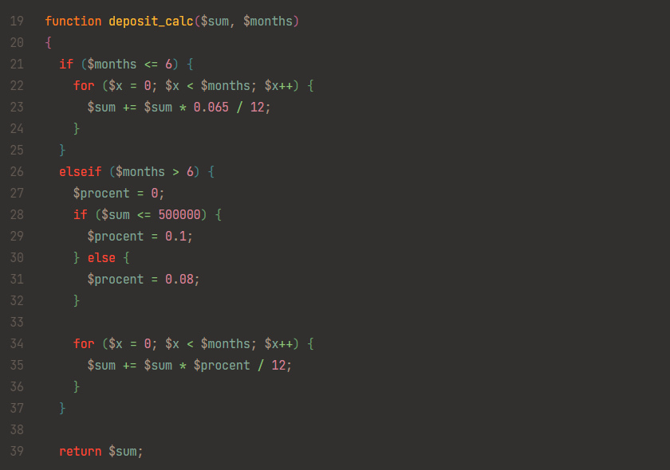

## Краткое вступление

В данном репозитории находятся решения 20 различных алгоритмических задач, взятых из открытых источников в Интернете, а также из сборника задач по программированию (автор: Златопольский Д. М.).

Формулировки многих задач для большего интереса были дополнены и усложнены.

Исходный код представлен на языке программирования PHP (версия интерпретатора = 8.1.24).

• • • • • • • • • • • • • • • • • • • • • • • • • • • • • • • • • • • •

<details><summary>💿 Установка и запуск решений на компьютере:</summary>

<br>

Для запуска скриптов необходимо клонировать [(скачать)](https://github.com/sudomango/PHP-Algo-A/archive/refs/heads/main.zip) весь репозиторий.

```shell
git clone https://github.com/sudomango/PHP-Algo-A.git
```

Любой скрипт следует запускать **только из каталога, в котором он расположен**, ни из какого другого.

Запуск решений в командной строке Windows или Linux (проверено на Ubuntu Server):

```shell
cd Block_##
php script_name.php
```

Далее действуем согласно инструкциям скрипта и условиям конкретной задачи.

</details>

<div style="margin-top: 16px"></div>

• • • • • • • • • • • • • • • • • • • • • • • • • • • • • • • • • • • •

## Список задач в репозитории

<details><summary>Первый блок задач (задачи 01 - 10):</summary>

<br>

01\. Функция, которая проверяет, является ли указанный год високосным.

[Исходный код решения](https://github.com/sudomango/PHP-Algo-A/blob/main/Block_01/01%20-%20is_leap_year.php)

<br>

02\. Функция, которая проверяет, является ли число, переданное в качестве аргумента, простым.

[Исходный код решения](https://github.com/sudomango/PHP-Algo-A/blob/main/Block_01/02%20-%20is_prime_number.php)

<br>

03\. Функция, которая генерирует одномерный массив случайных целых чисел размером count. Все числа должны находиться в диапазоне min_value ... max_value. Дополнительно следует реализовать возможность генерации массива, состоящего только из уникальных (неповторяющихся) элементов.

[Исходный код решения](https://github.com/sudomango/PHP-Algo-A/blob/main/Block_01/03%20-%20random_int_array.php)

<br>

04\. Фильтрация исходного массива: Дан массив из 100 случайных целых чисел. Создать два новых массива на основе первого = в первом оставить только чётные положительные числа, во втором - двузначные числа, кратные 10. Вывести оригинальный массив и оба получившихся массива на экран консоли.

[Исходный код решения](https://github.com/sudomango/PHP-Algo-A/blob/main/Block_01/04%20-%20array_filter.php)

<br>

05\. Использование ассоциативных массивов: Зарплата сотрудника вычисляется по формуле = 1000$ + 20$ за каждый отработанный час + 30$ за каждого нового клиента. Подсчитать зарплату каждого из сотрудников. Вывести их в порядке от "лучшего" к "худшему". Каждый сотрудник представляет собой ассоциативный массив.

[Исходный код решения](https://github.com/sudomango/PHP-Algo-A/blob/main/Block_01/05%20-%20salary_amount_calculate.php)

<br>

06\. Дан список продуктов на складе. У каждого есть срок его изготовления и срок годности (всегда указан в днях). Необходимо проверить, какие продукты на текущую дату можно считать просроченными, а какие - всё ещё свежими. Даты можно указать любые, главное, чтобы было видно, что функция работает правильно.

[Исходный код решения (использование функции strtotime)](https://github.com/sudomango/PHP-Algo-A/blob/main/Block_01/06%20-%20is_still_fresh_one.php)

[Исходный код решения (использование методов класса DateTime)](https://github.com/sudomango/PHP-Algo-A/blob/main/Block_01/06%20-%20is_still_fresh_two.php)

<br>

07\. Реализовать программу "Калькулятор для вклада". Пользователь вводит начальную сумму и количество месяцев, после чего должен получить финальную сумму, которая будет на вкладе по истечению указанного им срока. Условия вклада такие: любая сумма до 6 месяцев (включительно) = 6.5% годовых; если вклад делается на срок больше 6 месяцев, то для сумм больше 500.000 процентная ставка = 8%, для сумм меньших или равных 500.000 = 10%. Все вклады идут с ежемесячной капитализацией процентов (проценты каждый месяц прибавляются к сумме вклада, и в новом месяце процент считается уже от новой суммы).

Так как это учебная программа, результат при выводе разрешается округлить до 2-3 знаков после запятой.

[Исходный код решения](https://github.com/sudomango/PHP-Algo-A/blob/main/Block_01/07%20-%20deposit_calculator.php)

<br>

08\. Даны две строки, необходимо выяснить являются ли они анаграммами? В содержании строк следует учитывать только буквы и цифры. Пробелы и знаки препинания необходимо удалить или игнорировать их при сравнении. Сравнение сделать case-insensitive (регистронезависимым).

[Исходный код решения](https://github.com/sudomango/PHP-Algo-A/blob/main/Block_01/08%20-%20is_an_anagram.php)

<br>

09\. Вывести на экран сумму всех цифр указанного числа (функция должна работать в том числе и для отрицательных чисел, и для вещественных).

[Исходный код решения](https://github.com/sudomango/PHP-Algo-A/blob/main/Block_01/09%20-%20sum_of_all_digits.php)

<br>

10\. Реализовать функции dec_to_hex, hex_to_dec, dec_to_bin, bin_to_dec, rgb_to_hex, hex_to_rgb без использования аналогичных функций, встроенных в язык программирования. Входные данные = целые неотрицательные числа в указанной системе счисления в виде строки: "40AC20", "600", "1011011" и т. д. RGB-цвет должен быть представлен в виде массива из трёх целочисленных значений (0 .. 255).

[Исходный код решения](https://github.com/sudomango/PHP-Algo-A/blob/main/Block_01/10%20-%20dec_to_hex,%20hex_to_dec.php)

</details>

<div style="margin-top: 16px"></div>

• • • • • • • • • • • • • • • • • • • • • • • • • • • • • • • • • • • •

<details><summary>Второй блок задач (задачи 11 - 20):</summary>

<br>

11\. Количество вхождений элемента в последовательность: В текстовом файле записана произвольная строка или текст. Пользователь вводит символ или подстроку. Необходимо вывести, какое количество раз она повторяется в исходном тексте. Поиск сделать case-insensitive (регистронезависимым).

[Исходный код решения](https://github.com/sudomango/PHP-Algo-A/blob/main/Block_02/11%20-%20repeated_elements_count.php)

<br>

12\. Реализовать функцию, которая выводит на экран все делители указанного натурального числа.

[Исходный код решения](https://github.com/sudomango/PHP-Algo-A/blob/main/Block_02/12%20-%20find_all_divisors.php)

<br>

13\. Функция, которая раскладывает натуральное число (n > 1) на простые сомножители.

[Исходный код решения](https://github.com/sudomango/PHP-Algo-A/blob/main/Block_02/13%20-%20factorize_the_number.php)

<br>

14\. Дан массив из натуральных чисел. Найти НОД для всех чисел в указанном массиве.

[Исходный код решения](https://github.com/sudomango/PHP-Algo-A/blob/main/Block_02/14%20-%20nod_of_the_array.php)

<br>

15\. Решето Эратосфена: Вывести список всех простых чисел в диапазоне от 2 до \<user_number\>.

[Исходный код решения](https://github.com/sudomango/PHP-Algo-A/blob/main/Block_02/15%20-%20sieve_of_eratosthenes.php)

<br>

16\. Реализовать две функции для целочисленной арифметики денежных единиц: одна - для сложения, вторая - для вычитания. Мы знаем, что представление дробной части вещественного числа в компьютере не всегда точное из-за особенностей двоичной арифметики. Поэтому для денежных единиц обычно создаётся отдельный объект, в котором реализованы свои методы для арифметических операций с этим объектом. Копейки считаются отдельно, а рубли - отдельно. Так как мы пока не затрагиваем ООП, предлагается реализовать описанный функционал через ассоциативные массивы (словари).

[Исходный код решения](https://github.com/sudomango/PHP-Algo-A/blob/main/Block_02/16%20-%20money_true_calculation.php)

<br>

17\. Дан массив случайных чисел. Вывести на экран только уникальные (неповторяющиеся) элементы.

[Исходный код решения](https://github.com/sudomango/PHP-Algo-A/blob/main/Block_02/17%20-%20unique_elements.php)

<br>

18\. Реализовать две функции: Первая вычисляет, является ли указанная строка палиндромом. Вторая делает тоже самое, но для целых неотрицательных чисел. Можно использовать любой известный алгоритм для вычисления палиндромов.

[Исходный код решения](https://github.com/sudomango/PHP-Algo-A/blob/main/Block_02/18%20-%20palindrome_function.php)

<br>

19\. Матричная арифметика = целых четыре подзадачи в одной. В дальнейшем считать матрицу и двумерный массив синонимами. Все индексы будем считать с нуля.

Итак, дана квадратная матрица 5-го порядка. Можно наполнить её любыми целыми числами.

A\. Вывести на экран исходную и транспонированную ей матрицу. Вывод обязательно реализовать с выравниванием по столбцам.

B\. Вывести сумму элементов с чётными индексами на главной диагонали. Например: A[0][0], A[2][2] и т. д. Исходная матрица может быть любого размера (но она обязательно будет квадратной).

C\. Вывести последнюю цифру суммы всех элементов на главной и побочной диагоналях.

D\. Найти и вывести минимальный элемент матрицы и координаты (индексы) его последнего вхождения.

[Исходный код решения](https://github.com/sudomango/PHP-Algo-A/blob/main/Block_02/19%20-%20matrix_arithmetic.php)

<br>

20\. Найти и вывести на экран НОД и НОК для двух указанных натуральных чисел. Разрешается использовать любой известный алгоритм, кроме встроенных в язык программирования функций.

[Исходный код решения](https://github.com/sudomango/PHP-Algo-A/blob/main/Block_02/20%20-%20nok_and_nod_of_two_numbers.php)

</details>

<div style="margin-top: 16px"></div>

• • • • • • • • • • • • • • • • • • • • • • • • • • • • • • • • • • • •

## Некоторые примечания

Весь код проверен на работоспособность на Windows 10 и Ubuntu Server 22.04, результат выполнения всегда соответствует поставленному условию задачи.



Весь исходный код **служит для учебных целей**, в связи с чем в нём могут встречаться различные пояснительные комментарии, не всегда оптимальные алгоритмы, отладочная информация и так далее.
